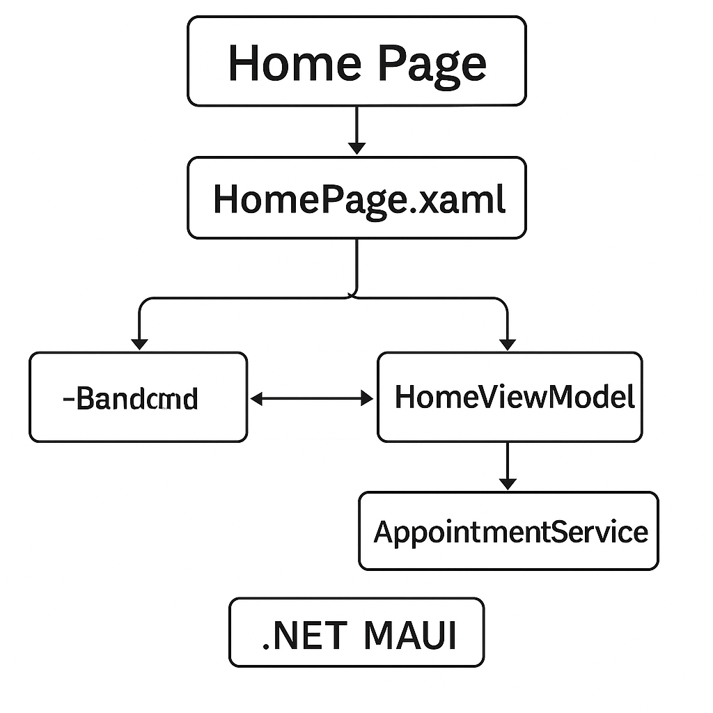
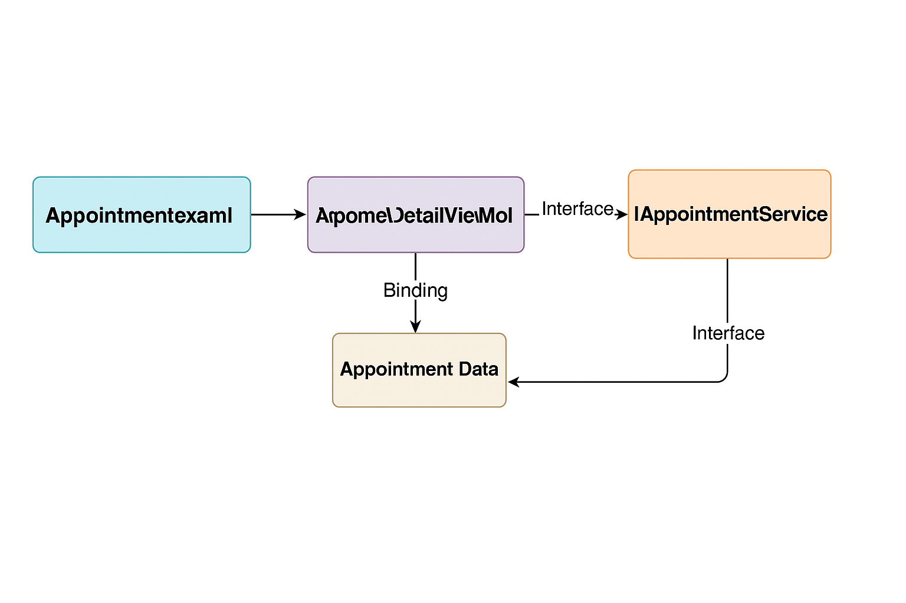

# Xamarin.Forms to .NET MAUI Migration – Sample Project

This repository demonstrates a structured migration approach from Xamarin.Forms to .NET MAUI using a real-world inspired app module.

### 🛠️ Technologies
- .NET MAUI (.NET 8)
- MVVM Toolkit (CommunityToolkit.MVVM)
- SQLite-net
- Firebase Cloud Messaging
- Dependency Injection (Microsoft.Extensions)
- Shell Navigation

---

## 📁 Project Structure

```
/XFtoMAUIApp
│
├── Views/
│   ├── HomePage.xaml
│   └── AppointmentDetailPage.xaml
│
├── ViewModels/
│   ├── HomeViewModel.cs
│   └── AppointmentDetailViewModel.cs
│
├── Models/
│   └── Appointment.cs
│
├── Services/
│   ├── IAppointmentService.cs
│   └── AppointmentService.cs
│
├── Resources/
│   ├── Fonts/
│   └── Images/
│
├── App.xaml / App.xaml.cs
├── MauiProgram.cs
└── appsettings.json
```

---

## 🧠 Key Migration Notes

- **XAML Reuse:** Most layouts were adapted directly from Xamarin.Forms with only minor changes to align with MAUI’s rendering engine.
- **ViewModels:** Fully migrated using `ObservableObject` and `RelayCommand` from MVVM Toolkit.
- **Navigation:** Implemented with `.NET MAUI Shell`, replacing NavigationPage stack logic.
- **Dependency Injection:** Integrated via `MauiProgram.cs` for services and viewmodels.

---

## 📸 UI Preview




---

## 📊 Architecture Diagram


---

## 🚀 Getting Started

1. Clone the repo:
```bash
git clone https://github.com/your-username/XF-to-MAUI-Migration-Sample.git
```

2. Open with Visual Studio 2022+ and select the `net8.0` target.

3. Run on Android Emulator or iOS Simulator.

---

## 📞 Want to see more?

Reach out for a full walkthrough or NDA-protected production repo review.
